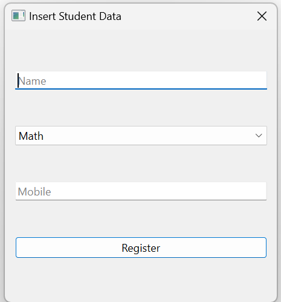
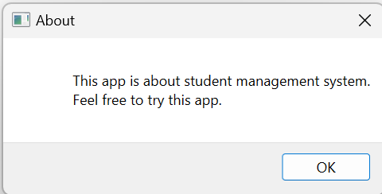
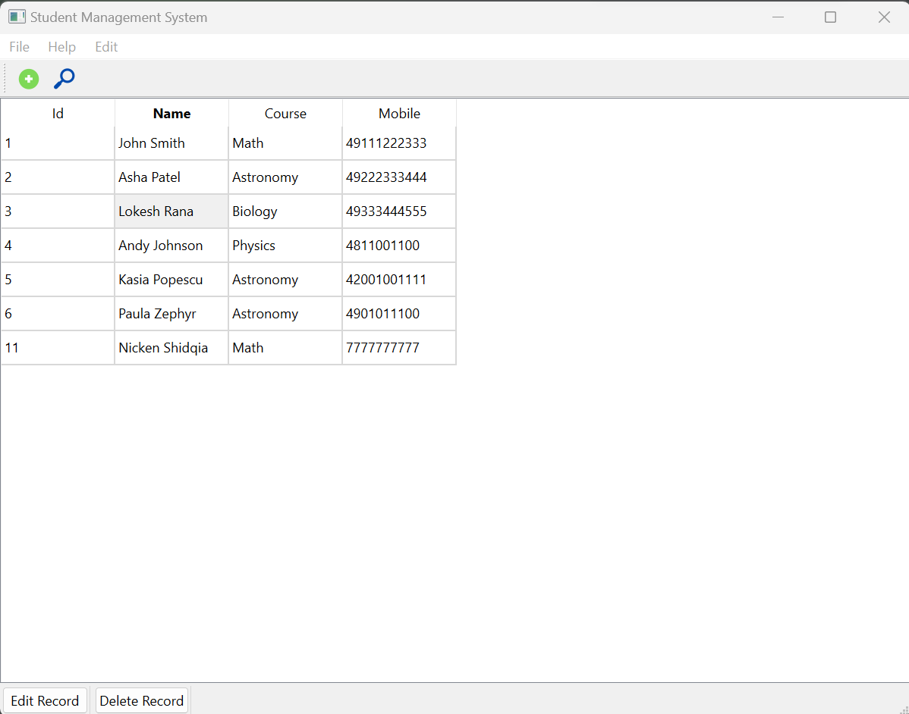

# Build a Student Management System with PyQt

## Project Description

**Overview :**  
The project will result in a fully functional Student Management System with a PyQt-based graphical user interface. Users will be able to effortlessly manage student data, including insertion, searching, editing, and deletion of records. This system can find applications in educational institutions where a simple and effective tool for managing student information is required.

**Challenges :**  
Build a Student Management System with PyQt using Python

## Project Goal

The goal of this project is to design and implement a comprehensive Student Management System using PyQt, allowing users to efficiently manage and organize student data.

## Tools & Library Used

 &nbsp;

## Project Result

[Click here to get full code](https://github.com/nickenshidqia/Build_a_Student_Management_System_with_PyQt/blob/c005d99b058a8abd38010c3f36b57f2483218ace/main.py)

### Key Features

- **Student Data Entry:** Design a form within the PyQt application that allows users to input essential student information, such as name, course, and mobile phone number.  
  
- **About Page:** Create an 'About' page providing information about the Student Management System.  
  
- **Editing and Updating:** Implement functions for adding, updating, and deleting records in the data store.  
  
- **Search Functions:** Implement a search bar or filter options that enable users to quickly locate specific student records.  
  
